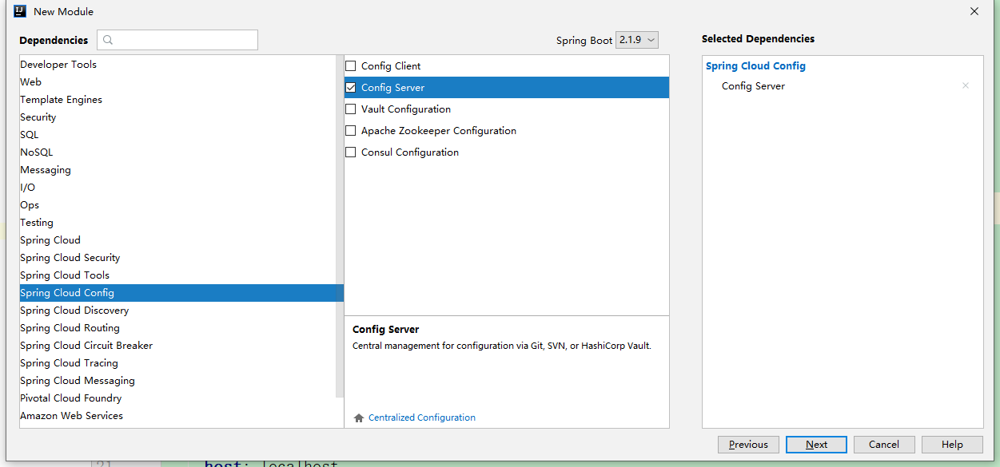
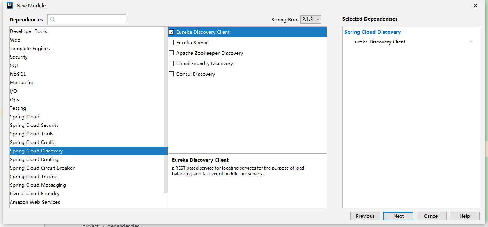
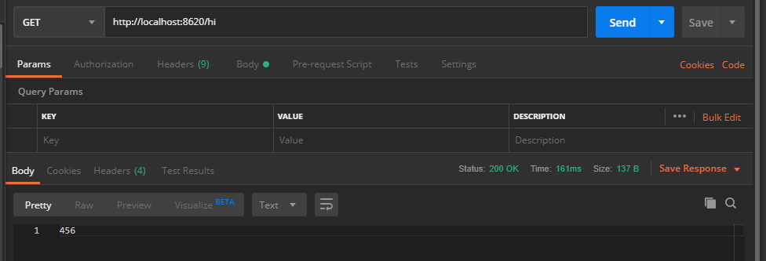
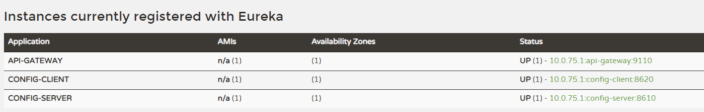

Spring Cloud Config用来为分布式和微服务应用提供集中化的配置支持，分为服务端和客户端。服务端是一个独立的微服务应用，用来连接仓库并为客户端提供配置信息；客户端则是微服务架构中的各个服务，通过指定的配置中心来管理配置内容，并在启动的时候从配置中心加载配置信息。

## 准备配置仓库

直接在之前的项目中新建config-reposity文件夹，并创建config-client子文件夹，等所有创建完成之后直接commit到仓库

假设需要读取配置的服务名称叫config-client，创建config-client-dev.yml

```yml
server:
  port: 8620
env: 456
```


## 创建服务端

新建一个Module，用Spring Initializr创建一个Spring Cloud Config项目，勾选Config Server以及Discovery中的eureka client





在主类上添加@EnableConfigServer注解

```java
@EnableConfigServer
@SpringBootApplication
public class ConfigServerApplication {

    public static void main(String[] args) {
        SpringApplication.run(ConfigServerApplication.class, args);
    }

}
```

在application.yml中添加配置

```yml
server:
  port: 8610
spring:
  application:
    name: config-server
  cloud:
    config:
      server:
        git:
          uri: https://github.com/zheyday/CloudOneConfig/
          # 如果是私有仓库 需要用户名和密码
          username: zheyday
          password: 
          search-paths: config-reposity/**
#注册到eureka-server
eureka:
  client:
    service-url:
      defaultZone: http://localhost:8761/eureka/
```

uri是本项目的仓库地址

如果这个仓库是私有的，那么就需要填写`username`和`password`

search-paths是搜索的路径，我们在开头创建了config-reposity文件夹，通常一个文件夹对应一个服务配置，所以要加/**表示所有路径

到这里配置中心就完成了。

完成了这些准备工作之后，我们就可以通过浏览器、POSTMAN直接来访问到我们的配置内容了。访问配置信息的URL与配置文件的映射关系如下：

- /{application}/{profile}[/{label}]
- /{application}-{profile}.yml
- /{label}/{application}-{profile}.yml
- /{application}-{profile}.properties
- /{label}/{application}-{profile}.properties

上面的url会映射`{application}-{profile}.properties`对应的配置文件，其中`{label}`对应Git上不同的分支，默认为master。我们可以尝试构造不同的url来访问不同的配置内容，比如，要访问master分支，config-client应用的dev环境，就可以访问这个url：`http://localhost:8710/config-client/dev/master`

## 创建客户端

同创建服务端一样，只不过这里勾选config client

主类

```java
@RefreshScope
@RestController
@SpringBootApplication
public class ConfigClientApplication {

    @Value("${env}")
    String info;
    @RequestMapping(value = "/hi")
    public String hi(){
        return info;
    }

    public String getInfo() {
        return info;
    }

    public void setInfo(String info) {
        this.info = info;
    }

    public static void main(String[] args) {
        SpringApplication.run(ConfigClientApplication.class, args);
    }

}
```

创建bootstrap.yml，来指定获取配置文件的git位置

```yml
spring:
  cloud:
    config:
      label: master
      profile: dev
      discovery:
        #开启通过服务从配置中心读取文件
        enabled: true
        service-id: config-server
      fail-fast: true
  application:
    name: config-client
```

注意：必须使用bootstrap来指定，因为bootstrap要比application先加载

- spring.application.name：对应配置文件规则中的`{application}`部分
- spring.cloud.config.profile：对应配置文件规则中的`{profile}`部分
- spring.cloud.config.label：对应配置文件规则中的`{label}`部分
- spring.cloud.config.discovery.service-id: 配置中心`config-server`的名称

启动服务端和客户端

通过postman访问http://localhost:8620/hi



可以看到，配置文件中的env已经加载到程序中

客户端也注册到了服务中心。端口号8620





## 动态刷新

### 服务端

添加依赖

```xml
        <dependency>
            <groupId>org.springframework.boot</groupId>
            <artifactId>spring-boot-starter-actuator</artifactId>
        </dependency>

        <!--        动态刷新依赖-->
        <dependency>
            <groupId>org.springframework.cloud</groupId>
            <artifactId>spring-cloud-starter-bus-amqp</artifactId>
        </dependency>
```

application.yml添加

```yml
management:
  endpoints:
    web:
      exposure:
        include: "*"
```

### 客户端

```xml
        <dependency>
            <groupId>org.springframework.boot</groupId>
            <artifactId>spring-boot-starter-actuator</artifactId>
        </dependency>

        <!--        动态刷新依赖-->
        <dependency>
            <groupId>org.springframework.cloud</groupId>
            <artifactId>spring-cloud-starter-bus-amqp</artifactId>
        </dependency>
```

config-client-dev.yml新增

```yml
spring:
  rabbitmq:
    host: localhost
    port: 5672
    username: guest
    password: guest
```

在需要动态更新的类上加`@RefreshScope`注解，这里在主类上添加

postman通过POST方式访问http://localhost:8610/actuator/bus-refresh进行刷新。

## 非对称加密

### 准备工作

为了启用该功能，我们需要在配置中心的运行环境中安装不限长度的JCE版本（Unlimited Strength Java Cryptography Extension）。虽然，JCE功能在JRE中自带，但是默认使用的是有长度限制的版本。我们可以从Oracle的官方网站中下载到它，它是一个压缩包，解压后可以看到下面三个文件：

`README.txt
local_policy.jar
US_export_policy.jar`

我们需要将`local_policy.jar`和`US_export_policy.jar`两个文件复制到`$JAVA_HOME/jre/lib/security`目录下，覆盖原来的默认内容。到这里，加密解密的准备工作就完成了。

### 相关端点

- `/encrypt/status`：查看加密功能状态的端点
- `/key`：查看密钥的端点
- `/encrypt`：对请求的body内容进行加密的端点
- `/decrypt`：对请求的body内容进行解密的端点

### 开始

首先，我们需要通过`keytool`工具来生成密钥对。`keytool`是JDK中的一个密钥和证书管理工具。它使用户能够管理自己的公钥/私钥对及相关证书，用于（通过数字签名）自我认证（用户向别的用户/服务认证自己）或数据完整性以及认证服务。在JDK 1.4以后的版本中都包含了这一工具，它的位置在：`%JAVA_HOME%\bin\keytool.exe`

```xml
$ keytool -genkeypair -alias config-server -keyalg RSA \ 
  -dname "CN=zhaiyongchao, OU=company, O=organization, L=city, ST=province, C=china" \
  -keypass 222222 \
  -keystore config-server.keystore \
  -storepass 111111 \
  -validity 3650 \
```

keypass是私钥

storepass是秘钥

执行完之后会在当前文件夹生成config-server.keystore文件，将其复制到服务端工程的resources下，并且新建bootstrap.yml

```yml
encrypt:
  key-store:
    location: config-server.keystore
    alias: config-server
    password: 123456
    secret: 123456
```

### 测试

命令行输入

curl  http://localhost:8610/encrypt -d 123

得到一长串字符，这就是加密后的结果。将其复制到配置文件中，如下格式：

`env:'{cipher}asldkfjalskdfja'`

