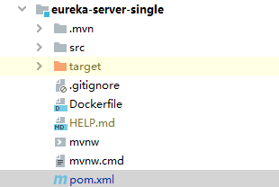
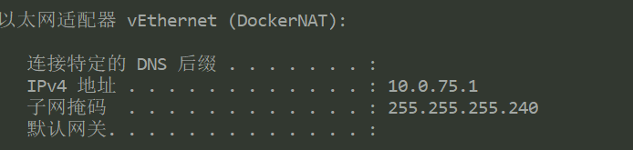

几个模块本地测试完之后，将各个模块打包成docker镜像

遇到的坑放在最后，如果哪一步遇到了问题可以先行查看

需要在环境变量中配置DOCKER_HOST

## Dockerfile

以eureka-server-single模块为例，在模块根路径下创建Dockerfile文件



内容如下

```dockerfile
FROM java:8
VOLUME /tmp
ADD target/eureka-server-single-0.0.1-SNAPSHOT.jar app.jar
RUN bash -c 'touch /app.jar'
EXPOSE 8761
ENTRYPOINT ["java","-jar","/app.jar"]
```

配置是网上找的，大致说明一下意思：

FROM是基础镜像

ADD的前半部分是项目打成jar包之后的路径

EXPOSE是要暴露的端口

## pom.xml

在属性一栏配置一下仓库地址，因为最后要上传到阿里云镜像

```xml
	<properties>
        <java.version>1.8</java.version>
        <spring-cloud.version>Greenwich.SR1</spring-cloud.version>
        <docker.registry>registry.cn-shanghai.aliyuncs.com/zcs</docker.registry>
    </properties>
```

打包使用了dockerfile-maven-plugin，因此在build下配置

```xml
			<plugin>
                <groupId>com.spotify</groupId>
                <artifactId>dockerfile-maven-plugin</artifactId>
                <version>1.4.13</version>
                <executions>
                    <execution>
                        <id>default</id>
                        <goals>
                            <goal>build</goal>
                            <goal>push</goal>
                        </goals>
                    </execution>
                </executions>
                <configuration>
                    <!--     镜像名称-->
                    <repository>${docker.registry}/${project.artifactId}</repository>
				   <!--    镜像的tag 默认就是latest-->
                    <tag>latest</tag>
                    <dockerfile>Dockerfile</dockerfile>
                    <!--     Dockerfile的路径-->
                    <contextDirectory>${project.basedir}</contextDirectory>
                    <buildArgs>
                        <!--     项目jar包路径-->
                        <!--     finalName = artifactId + version-->
                        <JAR_FILE>target/${project.build.finalName}.jar</JAR_FILE>
                    </buildArgs>
                </configuration>
            </plugin>
```

## 打包

配置完上述之后，直接用maven的Lifecycle打包即可

## docker-compose

## 坑

### 1、 打包失败

要注意打包的项目是不是依赖其他的包。比如本项目需要oauth2模块先启动

### 2、连不上宿主机数据库

ipconfig可以看出多了一个DockerNAT，docker内部是通过桥和宿主机通信的，因此ip地址也变了



可以看出，对docker来说windows的ip是10.0.75.1，,docker自己是10.0.75.2，而我们平时连接数据库的时候是通过root@localhost用户来连接的，所以需要更改两个地方

1. 在项目中更改applicaiton.yml数据库的配置，只需要将url的localhost改为10.0.75.1即可

   ```yml
   spring:
     datasource:
       driver-class-name: com.mysql.cj.jdbc.Driver
       url: jdbc:mysql://10.0.75.1/seckill?serverTimezone=UTC&characterEncoding=UTF-8&nullCatalogMeansCurrent=true
       username: root
       password: 123456
   ```

   

2. 安装数据库的时候有可能我们只给了root@localhost用户权限，所以我们需要再创建一个用户并给权限

   我这里使用的是mysql8

```mysq
mysql> create user 'root'@'10.0.75.2' identified by '123456';
mysql> grant all privileges on *.* to 'root'@'10.0.75.2' with grant option;
mysql> flush privileges;
```

对于以前的版本来说应该是

```my
mysql> grant all privileges on *.* to 'root'@'10.0.75.2' identified by '123456' with grant option;
```

这两项配置完之后就应该可以访问数据库了