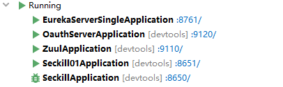

## 秒杀系统设计

### 微服务和分布式

微服务：根据业务将整体拆分成一个个独立的服务单元，每个单元只负责一个功能

分布式：将服务分部到多个服务器上，单体应用和微服务都可以是分布式

### RESTful API

每个URI代表一种资源，资源是实体，可以有多种表现形式，称为表现层。访问网站就代表了客户端和服务器的一个互动过程。客户端通过HTTP动词，对服务器资源进行操作，完成表现层状态转化

所以URI中只能有名词

### 流量治理

前端：页面动静分离、CDN缓存

用户侧限流：

网关限流：

应用系统限流：

令牌桶算法：

分流

### redis集群

对于秒杀系统来说，商品信息和秒杀成功信息都保存在redis中，所以要保证redis的高可用。

主从和哨兵都没法解决写压力，所以采用集群

使用三个节点作为集群，每个master再挂三个slave，当master挂机的时候选举一个slave作为master

## 正文

现在有如下几个服务



EurekaServerSingle是服务注册中心

OauthServerApplication是OAuth2服务器

Zuul是网关，负责服务转发、负载均衡、熔断

Seckill是秒杀服务

## 准备工作

新建一个JMeter测试计划，添加如下内容


添加步骤：

1. 右击测试计划 --> 添加 --> 线程 （用户）--> 线程组，线程数设置5000，Ramp-Up设为1，也就是1启动5000个线程
2. 右击线程组 --> 添加  -->取样器 --> HTTP请求，配置要访问的路径
3. 右击HTTP请求 --> 添加 --> 配置元件--> HTTP信息头管理器，这个下面说明
4. 右击线程组 --> 添加  -->监听器 -->察看结果树/聚合报告

说明一下：

由于所有的资源都被OAuth2保护起来了，所以想要访问必须要经过登陆授权的步骤，为了方便起见，先在浏览器正常访问一个资源进行授权，然后获取里面的cookie值，放入HTTP信息头管理器中


在Cookie中有个 JSESSIONID ，把它们整个放到HTTP信息头管理器


## 测试

### 一、最简单的加锁

程序加synchronized锁，先读取数据库信息，然后自减，再更新，所有的逻辑操作都在程序中完成

```java
	@GetMapping("/order")
    public String reduceStack(@Param("id") String id) {
        Integer number;
        synchronized (this) {
            Seckill seckill = seckillService.getById(id);
            number = seckill.getNumber();

            if (number > 0) {
                seckill.setNumber(--number);
                seckillService.updateById(seckill);
                number = seckillService.getById(id).getNumber();
            }
        }

        ResultData<Integer> resultData = new ResultData<Integer>(20000, "number", number);

        Gson gson = new GsonBuilder().setDateFormat(DateFormat.FULL, DateFormat.FULL).create();
//        System.out.println(System.currentTimeMillis()-start);
        return gson.toJson(resultData);
    }
```


显然，可以看到吞吐量低

因为这段程序进行了加锁，而且所有的逻辑都在程序里执行，和数据库的交互也存在时间延迟

### 二、在数据库中完成

自检操作在数据库中完成，SeckillMapper中添加函数

```java
	@Update("update seckill set number=number-1 where id=1 and number > 0 ")
    Integer minusOne();
```

减库存逻辑函数修改为

```java
    @GetMapping("/order")
    public String reduceStack(@Param("id") Integer id) {
//        long start=System.currentTimeMillis();
        Integer number=-1;
        if (seckillService.minusStack(id)!=0){
            number = seckillService.getById(id).getNumber();
        }
        ResultData<Integer> resultData = new ResultData<Integer>(20000, "number", number);

        Gson gson = new GsonBuilder().setDateFormat(DateFormat.FULL, DateFormat.FULL).create();
//        System.out.println(System.currentTimeMillis()-start);
        return gson.toJson(resultData);
    }
```

测试结果


由于去掉了锁的限制，整个逻辑只有对数据库一行代码的操作，在提升速度的同时也保证了原子性

### 三、使用redis

#### 分布式锁

这个属于悲观锁，原理大概是一个线程在操作数据的时候加一把锁，不允许其他线程进行操作，主要利用setnx命令（ SET if Not exists ），就是当key不存在时，将key设为value，并返回1，否则返回0。操作结束后将该key删除。同时为了防止发生死锁，要设置key的过期时间

这里设置key为lock，value=1，过期时间是1s，具体的redisUtil方法后面贴出

goods的值在初始化中进行设置，预先加载到内存中

```java
	   if (!redisUtil.setnx("lock",1,1))
            return "so busy";
        Integer number = (Integer) redisUtil.get("goods");
        if (number > 0) {
             number=redisUtil.decrBy("goods",1);
        }
        redisUtil.unlock("lock");
```

测试结果如下，同时也没有出现超卖情况


#### 乐观锁

乐观锁是基于数据版本实现的，数据库中是在表中添加version字段，在读取数据时将version一同读出，之后进行写操作时对version加1。提交数据时如果该值比当前表中记录的值大，则更新，否则就是过期数据。在redis中，可以使用watch加事务实现，通过watch监视指定的key，当exec时如果key发生改变，则整个事务失败

<font color="red">注意</font>

redis是单线程，单个命令的执行是原子性的，但是redis在事务上没有任何原子性的限制，所以事务不是原子性的，中间某条指令的失败不会导致前面指令的回滚，也不会造成后续指令停止。事务可以理解为一个打包的批量执行脚本，在执行MULTI指令后，会将所有指令放入一个队列中，最后执行EXEC命令之后，Redis再执行队列里的命令。

但是

1. discard可以取消事务
2. watch一个key，如果事务exec之前这个key被改动，那么事务将被打断

```java
	public boolean watch(String key) {
        redisTemplate.watch(key);
        Integer number = (Integer) get(key);
        if (number <= 0) {
            return false;
        }
        redisTemplate.multi();
        redisTemplate.opsForValue().decrement(key, 1);
        List<Object> list = redisTemplate.exec();
        return list.size() != 0;
    }
```


从结果上看，两种方法的吞吐量好像差不多，乐观锁的还低一点，不太明白这样是否正常，按理说应该高一点才对。

#### lua脚本

上面乐观锁的处理略显臃肿，需要watch一个key，还要开启事务等一系列操作。那么如果优雅的进行原子性的操作呢？这时候lua就出来了

使用lua脚本后，redis程序会有明显的性能提升

- 减少网络io操作：上节的操作会向redis服务器发起多次请求，现在用一个请求即可完成
- 原子操作：redis会将整个脚本作为一个整体运行
- 复用：脚本会永久存储在redis中

redis-cli中先试试

```mysq
eval "return redis.call('DECRBY',KEYS[1],1)" key-num [key1 key2 ....] [value1 value2....]
```

- eval命令表示执行lua脚本
- 双引号里是具体的内容
- KEYS[1]对应的是后面传入的key参数，还有ARGV[1]对应的是value参数
- key-num表示key的个数
- [key1 key2]是key作为参数传给lua，要和key-num对应
- [value1 value2]也是参数

**RedisUtil中添加**

```java
    private DefaultRedisScript<Long> redisScript;

	@PostConstruct
    public void init() {
        redisScript = new DefaultRedisScript<>();
        redisScript.setResultType(Long.class);
        redisScript.setScriptText("local number = tonumber(redis.call('get',KEYS[1]))\n" +
                "if number <= 0 then\n" +
                "    return 0;\n" +
                "end\n" +
                "return redis.call('DECRBY',KEYS[1],1);");
//        redisScript.setScriptSource(new ResourceScriptSource(new ClassPathResource("seckill.lua")));
//        redisScript.setLocation(new ClassPathResource("seckill.lua"));
    }
```

注意：这里貌似只能使用Long，Integer会报错

直接把脚本写成string，不用每次都要从文件加载，速度会快一些

```java
	public Long lua(String key) {
        List<String> keyList = new ArrayList<>();
        keyList.add(key);
        return redisTemplate.execute(redisScript, keyList);
    }
```

keyList用于存储需要用到的key


### 四、RabbitMQ出场

RabbitMQ并不是为了取代redis，只是存储秒杀信息用于订单处理，所以在秒杀这部分功能还是使用redis

配置一个队列

```java
@Configuration
public class RabbitDirectConfig {
    @Bean
    public Queue seckillQueue(){
        return new Queue("seckill");
    }
}
```

还是用redis进行交互，成功后将手机号放入队列

```java
    @GetMapping("/orderMq")
    public String reduceStackMq(@Param("id") Integer id, @Param("phone") String phone) {
        if (localOverMap.get(id))
            return commonUtil.toJson(ResponseState.OK, "number", -1);

        Long number = redisUtil.lua(KEY, SUCCESS, phone);
        if (number >= 0) {
//            成功
            amqpTemplate.convertAndSend("seckill",phone);
        }else
            localOverMap.put(id,true);
        return commonUtil.toJson(ResponseState.OK, "number", number);
    }
```


## 坑

<font color="red">注意</font>

1. 如果线程数选的过大，比如10w，可能会报<font color="red"> Address already in use : connect </font>
   原因：windows提供给TCP/IP链接的端口为 1024-5000，并且要四分钟来循环回收它们，就导致我们在短时间内跑大量的请求时将端口占满了，导致如上报错。 

   解决办法（在jmeter所在服务器操作）：

   1.cmd中输入regedit命令打开注册表；

   2.在 HKEY_LOCAL_MACHINE\SYSTEM\CurrentControlSet\Services\Tcpip\Parameters右键Parameters；

   3.添加一个新的DWORD，名字为MaxUserPort，如果有的话就不用新建；

   4.然后双击MaxUserPort，输入数值数据为65534，基数选择十进制；

   5.完成以上操作，务必重启机器，问题解决，亲测有效；

2. <font color="red"> org.apache.http.conn.HttpHostConnectException: Connect to localhost:80</font>
   JMeter的HTTP请求里的服务器名称要和工程里application.yml配置一样，比如都是localhost或者192.168.0.xxx

